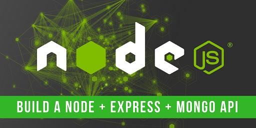

# Nodejs API for TODO APP(Backend) [Demo](http://tutorials.way2programming.com/apps/todo-app-with-mongodb-support/index.html)



This project provides Nodejs API with Express and MongoDB, a backend for frontend or use it as a base for building any kind of API.

## API calls

we can use `Postman client` to test all API calls. If you are running app in localhost just change URL to `http://localhost:5000/api/todos` .


| Request Type          | URL                                   | Description |
|-----------------------|---------------------------------------|-------------|
| GET                   | https://localhost:5000/api/todos | Get all todos |
| GET                   | https://localhost:5000/api/todos/{{id}} | Get todo |
| POST                  | https://localhost:5000/api/todos | Post todo<br/> sample payload:<br/>`{"desc": "need to join training", "priority": "Medium"}` |
| DELETE                | https://localhost:5000/api/todos/{{id}}     | Delete By _id |
| PATCH                 | https://localhost:5000/api/todos/{{id}} | Update only few attribute<br/>   sample payload:<br/> `{"isCompleted":false,"lastUpdated":"2018-01-17T17:57:15.370Z"}` |


### Please go to below link for Frontend

[Angular5 TODO APP Git Repo](https://github.com/mdarif-k/angular-todo-app-using-mongodb-backend)

## Getting Started

These instructions will help you to up and running app on your local machine for development and testing purposes. you can deploy app in local system.

### Prerequisites

We need to install the mongodb in our system after installation go to bin directory and open command prompt and give below commands

```
> mongod
> mongo
```
when we will use mongo command our mongodb server will restart and now we need to create the database, use below command to create the database

```
> use todo
```

the above command will create the database and switched to the same database

### Installing

need to install npm packages

```
> npm install
```

## Deployment in local system

we need to use below command to run our app

```
> node index.js
```


## Built With

* [Nodejs](https://nodejs.org/en/) - Node.js uses an event-driven, non-blocking I/O model that makes it lightweight and efficient
* [express](https://www.express.com/) - Allows to set up middlewares to respond to HTTP Requests.
* [mongoose](http://mongoosejs.com/docs/) - Used to connect to mongodb